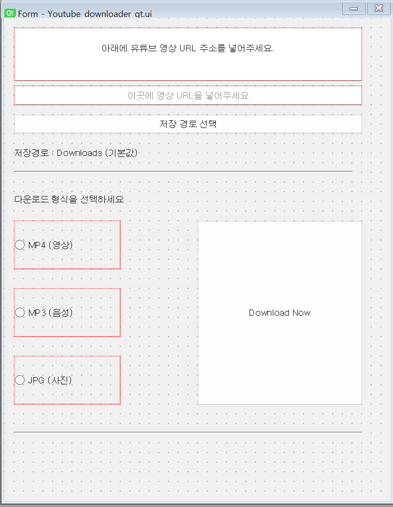
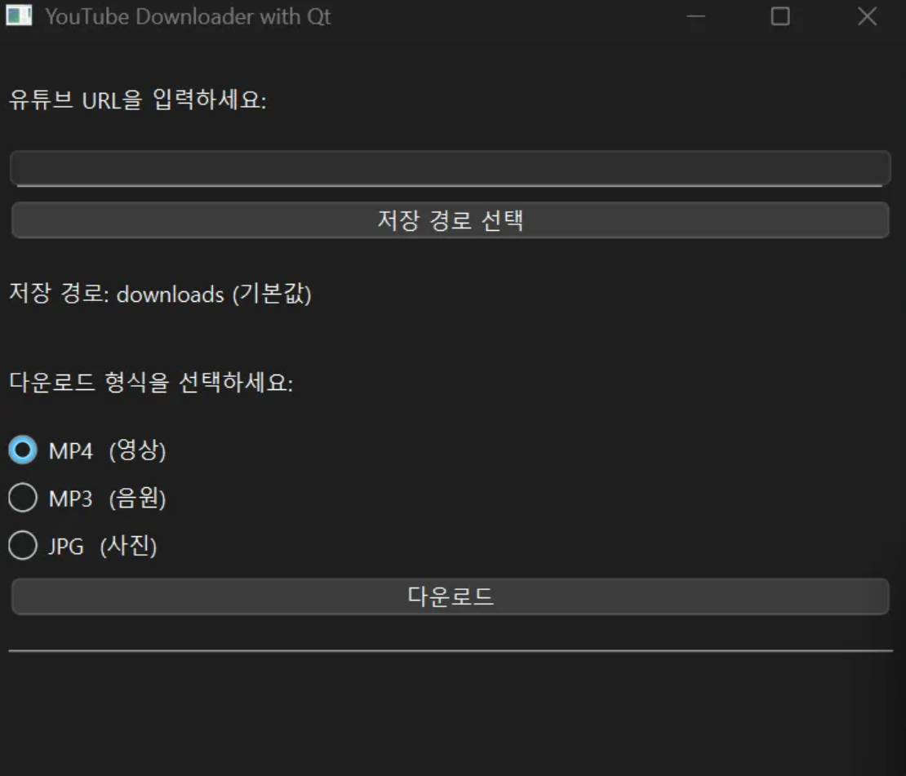

# Youtube_MP4-MP3-JPG_Downloader
이 프로젝트는 유튜브 동영상을 다운로드하여 MP4(영상), MP3(음원), JPG(프레임 이미지) 형식으로 저장할 수 있는 데스크톱 애플리케이션입니다. Python과 PySide6 기반으로 만들어졌으며, `yt-dlp`와 `ffmpeg` 라이브러리를 사용합니다.

QT디자인 예시, 미완성.

구동 시 메인 화면

URL 미입력시 오류 박스 출력

